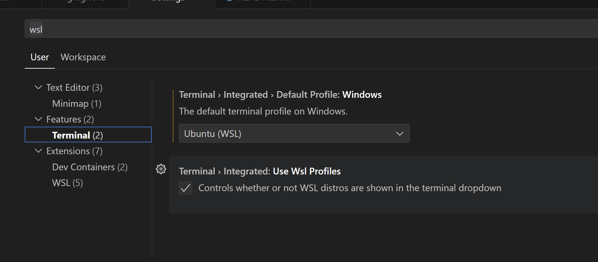
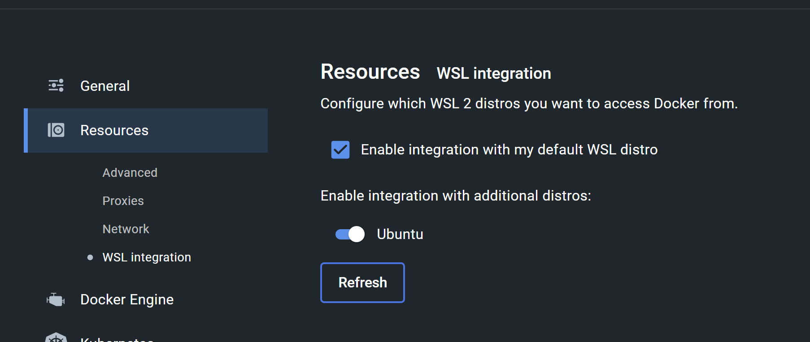

# Introduction
This project is the _front door_ to the MES POC system. The system is composed of several individual Git repositories each containing their own domain of source code and/or configuration. This project orchestrates, as the name says, those projects together and provides the developer with several tools for getting the whole system up and running as well as testing changes.

# Pre-requisites
* Have Docker Desktop installed locally and running.
* Ensure that Docker Desktop is configured to run a local Kubernetes server.

# Getting Started
## For VS Code
1. Install VS Code
2. Install WSL (Ubuntu) `wsl --install -d Ubuntu-22.04`
3. Set WSL (Ubuntu) as the default terminal for VS Code.
 - Go to `File` > `Preferences` > `Settings`
 - Search for `wsl`
 - Go to `Features` > `Terminal` and select `Ubuntu (WSL)` from the drop down. 
4. Configure Docker to use WSL
 - `Settings` > `Resources` > `WSL Integration` - Check the box and toggle the switch for `Ubuntu`
5. Install dotnet sdk in WSL 
 - `sudo apt-get update && \
  sudo apt-get install -y dotnet-sdk-7.0`

## For Visual Studio
TBD

# Get the Environment Up and Running
## Set Environment Variables
1. Copy the `.config-dist` file to `.config`
1. Modify the new `.env` file to fit your configuration.
1. Copy the `.secret-dist` file to `.secret`
1. Modify the new `.secret` file to fit your configuration.
1. Run `bash ./init.sh`

This should clone the component projects to assemble the network, build necessary Docker images, and deploy to Kubernetes.

# Extras
## Cleaning
You can _clean_ the project by running `./clean.sh`. This will remove all component project repositories and spin down Docker/Kubernetes and remove any associated images.
